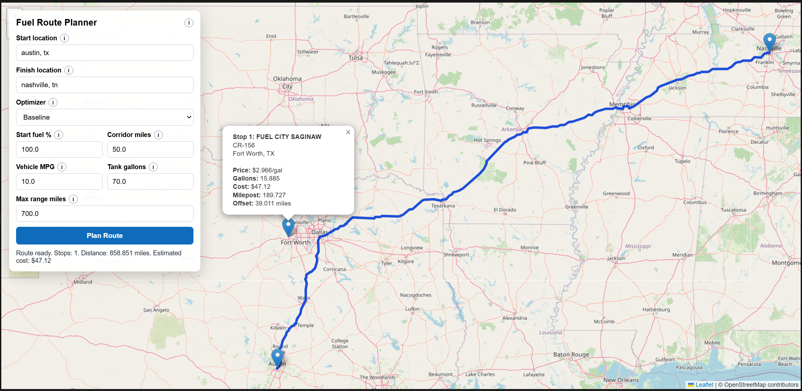
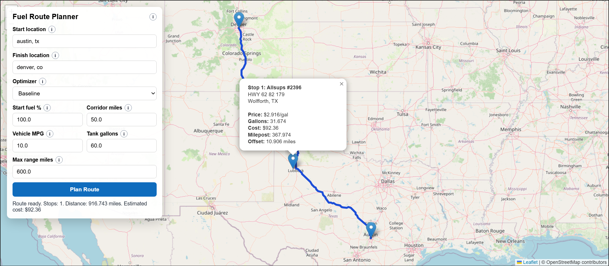

# Fuel Route Planner (Django 6.0)

Backend + web UI that:
- Accepts start and finish locations within the USA.
- Builds a route using OSRM free demo API.
- Selects optimal fuel stops along the route based on price data.
- Supports baseline optimization and optional OR-Tools optimization.
- Returns route geometry, fuel stops, and total fuel spend.
- Provides an interactive Leaflet/OpenStreetMap page for route planning and visualization.

## Stack
- Python 3.12+
- Django 6.0
- Polars (CSV parsing/normalization)
- Pydantic (request/response validation)
- OR-Tools (optional optimizer mode)
- pytest / ruff / ty

## Project Layout
- Source: `src/`
- Tests: `tests/`
- Fuel CSV: `fuel-prices-for-be-assessment.csv`

## Quick Start
1. Install dependencies:
```bash
uv sync
```

2. Apply migrations:
```bash
uv run python src/manage.py migrate --noinput
```

3. Import fuel prices (Polars-based):
```bash
uv run python src/manage.py import_fuel_prices --csv-path fuel-prices-for-be-assessment.csv
```

4. Geocode stations (run in batches; Nominatim-friendly pacing):
```bash
uv run python src/manage.py geocode_fuel_stations --limit 100 --sleep-seconds 1.1
```

5. Start server:
```bash
uv run python src/manage.py runserver
```

6. Open the web UI: `http://127.0.0.1:8000/` (map view)

## Docker
Container images install and run dependencies with `uv` (no `pip` usage).

1. Create environment file:
```bash
cp .env.example .env
```

2. Start development stack:
```bash
docker compose up --build
```

3. Run one-off commands in the container:
```bash
docker compose exec web uv run python src/manage.py import_fuel_prices --csv-path fuel-prices-for-be-assessment.csv
docker compose exec web uv run python src/manage.py geocode_fuel_stations --limit 100 --sleep-seconds 1.1
```

4. Production-style stack (Gunicorn + Nginx):
```bash
docker compose -f docker-compose.prod.yml up --build -d
```

## API
### Health
`GET /api/v1/health`

Example response:
```json
{
  "status": "ok",
  "stations": {
    "total": 100,
    "geocoded": 95
  }
}
```

### Route Plan
`POST /api/v1/route-plan`

Request body:
```json
{
  "start_location": "Austin, TX",
  "finish_location": "Chicago, IL",
  "start_fuel_percent": 100,
  "corridor_miles": 8,
  "optimizer": "ortools",
  "vehicle_mpg": 10,
  "tank_capacity_gallons": 50,
  "max_range_miles": 500
}
```

- `optimizer`: `baseline` or `ortools`
- `start_fuel_percent`: 0 to 100
- `corridor_miles`: 1 to 50
- `vehicle_mpg` (optional): >0 to 100
- `tank_capacity_gallons` (optional): >0 to 300
- `max_range_miles` (optional): >0 to 2000
- If optional vehicle fields are omitted, values come from Django settings defaults.

Response includes:
- `route_geojson` (`LineString`)
- `stops` with station details, milepost, gallons, and per-stop cost
- `summary.total_fuel_cost`
- assumptions (`mpg`, `range`, `tank`)

## Web UI
`GET /`

Interactive map page built with Leaflet + OpenStreetMap:
- Floating panel with start and finish location inputs.
- Planner options include optimizer, start fuel percent, corridor miles, vehicle MPG, tank capacity gallons, and max range miles.
- Submits to `POST /api/v1/route-plan`.
- Draws returned route polyline on the map.
- Renders clickable fuel-stop markers with per-stop popup details.

## Screenshots



## Behavior and Assumptions
- Default vehicle MPG: 10
- Default max range: 500 miles
- Default tank capacity: 50 gallons
- Vehicle/range values can be overridden per request.
- Route computed with OSRM public demo endpoint.
- Start/finish geocoding constrained to USA.
- Station candidates are selected within a configurable corridor around the route.

## Commands
Lint:
```bash
uv run ruff check .
```

Format:
```bash
uv run ruff format .
```

Type check:
```bash
uv run ty check .
```

Tests:
```bash
uv run pytest
```

## Environment Variables
- `DJANGO_SECRET_KEY`
- `DJANGO_DEBUG` (default `1`)
- `DJANGO_ALLOWED_HOSTS`
- `OSRM_BASE_URL` (default `https://router.project-osrm.org`)
- `OSRM_TIMEOUT_SECONDS` (default `12`)
- `OSRM_RETRY_COUNT` (default `2`)
- `GEOCODING_BASE_URL` (default `https://nominatim.openstreetmap.org`)
- `GEOCODING_USER_AGENT` (set this for production)
- `GEOCODING_TIMEOUT_SECONDS` (default `12`)
- `GEOCODING_RETRY_COUNT` (default `2`)
- `ROUTE_CACHE_TTL_SECONDS` (default `600`)
- `GEOCODE_CACHE_TTL_SECONDS` (default `86400`)
- `MAX_RANGE_MILES` (default `500`)
- `VEHICLE_MPG` (default `10`)
- `FUEL_TANK_GALLONS` (default `50`)
- `DEFAULT_CORRIDOR_MILES` (default `8`)
- `MAX_CANDIDATE_STATIONS` (default `600`)

## Notes
- OSRM demo API is free but not intended for production SLAs.
- Geocoding all stations will take time due rate limits; use batched runs.
- OR-Tools mode is enabled through the same endpoint by setting `optimizer` to `ortools`.
